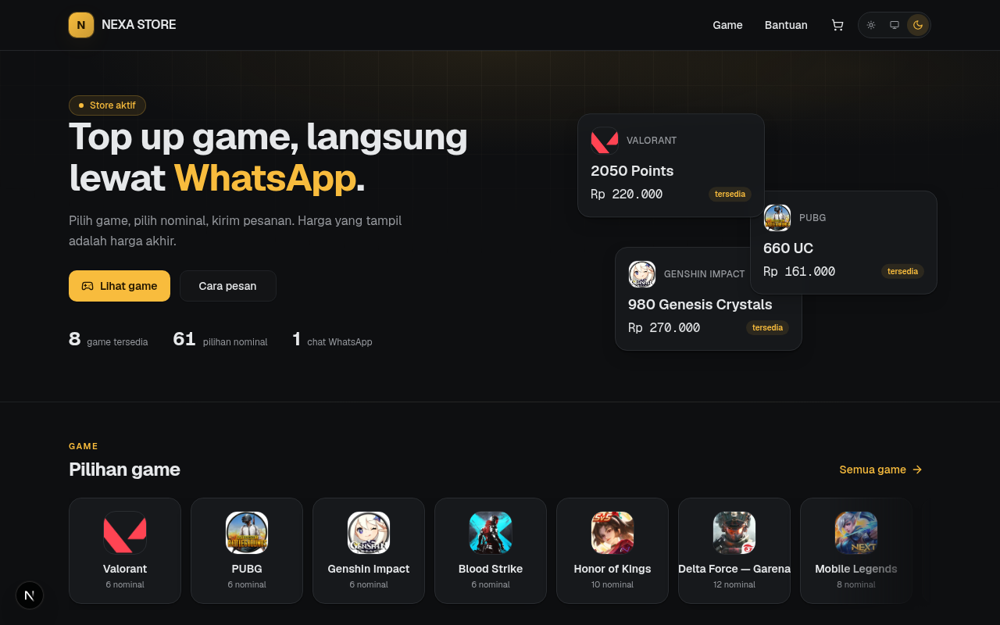
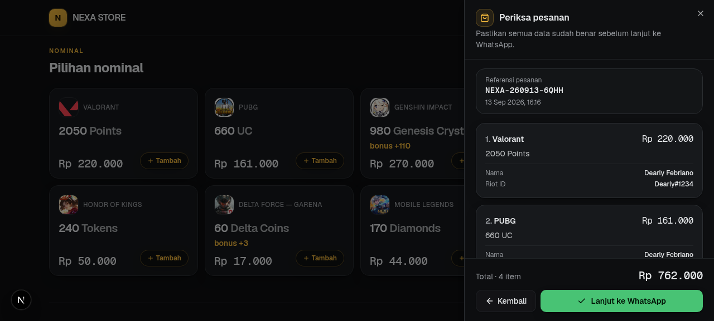
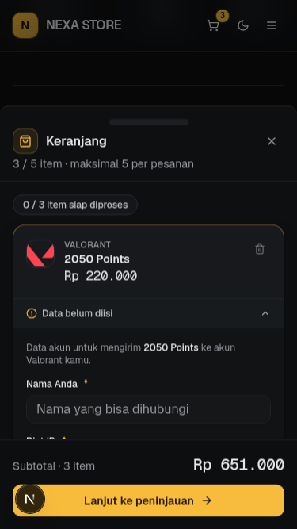

<div align="center">

# 🎮 NEXA STORE

**Top up game favorit, langsung lewat WhatsApp.**

🌐 **Live**: <https://nexastoregame.vercel.app>

A production-ready digital game top-up storefront with a multi-item cart,
per-game account forms, admin & developer panels, total/route lockdown &
maintenance modes, and a file-based catalog that can persist through GitHub.




</div>

---

## ✨ Features

### Storefront
- **Multi-item cart** — collect up to **5 products** across different games, each
  line with its **own recipient data** (Valorant asks for Riot ID, Mobile Legends
  asks for User ID + Zone ID, and so on — the form is generated from each
  game's field schema).
- **One structured WhatsApp message** for the whole cart: numbered items,
  explicit account data per item, order reference (`NEXA-YYMMDD-XXXX`), and a
  correct grand total. No JSON soup, no separate chats per product.
- **Two ways to order** — press a product card for the instant single-item
  flow, or press **Tambah** to collect items into the cart and checkout once.
- **Cart persistence** — the cart survives reloads via `localStorage`; stale
  entries (deleted/disabled products) are reconciled away with a clear notice.
- **Local order history** — lightweight, clearly labeled as device-local.
- **Scroll-aware edge fades** — horizontal scrollers only dim the side where
  more content exists; the last card always renders at full strength.
- Dark / light / system themes, scroll-reveal animations, `prefers-reduced-motion`
  respected, keyboard-accessible flows, mobile-first checkout.
- **Footer** with auto-year copyright and the developer credit
  ([Dearly Febriano](https://dearlyfebriano.vercel.app)) + visible app version.

### Admin panel (hidden route `/login`)
- Games, categories, products, prices — edited live with **conflict detection**
  (revision + per-file SHA) so two admins can't silently overwrite each other.
- Game **icon upload** (client-side canvas crop → WebP data URI).
- Store settings: name, WhatsApp number, announcement, maintenance mode.
- WhatsApp order template management with placeholder validation.
- **Collapsible sidebar** — the collapse toggle sits in the header next to the
  logo, with a global **Ctrl/Cmd+B** shortcut; state persists per browser.

### Developer panel (role-gated)
- **Admin blocking** — a blocked admin cannot log back in (enforced
  server-side). The block reason set by the Developer is shown to the admin in
  a full-screen **blocking modal** (skull + block icon), both on a login
  attempt and as a live takeover of an already-active dashboard session.
- **Kontrol Situs (site control)**:
  - **LOCKDOWN** — total or route-scoped (`/`, `/games`, `/games/…`, `/help`).
    Affected visitors are redirected to a red `/lockdown` screen that shows
    the Developer's reason. Enforced server-side (no storefront flash) and on
    soft navigations. Staff routes (`/login`, `/admin`, `/dev`) are never
    gated so the gate can always be lifted.
  - **Maintenance mode** — total or route-scoped, amber `/maintenance` screen
    with the Developer's message and a retry button.
  - Bypass rules: Developer passes everything; Admin is exempt from
    maintenance but subject to lockdown. If both cover a route, lockdown wins.
- Git sync status & history, data inspector, schema validation,
  diagnostics, deployment info.

### Data & persistence
- Catalog lives in **canonical JSON files** (`data/catalog/*.json`,
  `data/store/*.json`), validated by Zod schemas + integrity rules
  (duplicate ids, orphan references, zero prices, …).
- **Two adapters**:
  - `local` — read/write the JSON files (development, or read-only hosting).
  - `github` — commits every mutation to the repo via the GitHub API
    (single-commit batch writes), so catalog edits on production survive
    redeploys. Selected automatically when `GITHUB_*` env is complete.

## 🛒 Order flow

```
FIND GAME → CHOOSE PRODUCT → ADD TO CART → FILL ACCOUNT DATA → REVIEW → WHATSAPP
```

Cart review shows per-item completion status (`2/5 item siap diproses`),
incomplete items auto-expand, and the final review is an immutable snapshot
before the WhatsApp handoff.




## 🧱 Tech stack

| Layer      | Choice |
| ---------- | ------ |
| Framework  | Next.js 16 (App Router) + TypeScript 5 |
| UI         | Tailwind CSS 4, shadcn/ui (New York), Lucide icons |
| Animation  | Framer Motion |
| State      | Zustand (cart, persisted) + TanStack Query (server state) |
| Validation | Zod (catalog schemas, forms) + react-hook-form |
| Theme      | next-themes (dark / light / system) |
| Tests      | Bun test (63 unit tests) |

## 🚀 Quick start

```bash
# 1. Install
bun install        # or: npm install

# 2. Configure auth (required for the dashboard)
cp .env.example .env
#    → fill AUTH_ADMIN_*, AUTH_DEVELOPER_*, SESSION_SECRET (openssl rand -hex 32)

# 3. Run
bun dev            # or: npm run dev
```

Open http://localhost:3000 — the storefront is public; the dashboard lives at
the unlinked route `/login`.

## 🔐 Environment variables

| Variable | Required | Purpose |
| -------- | -------- | ------- |
| `AUTH_ADMIN_EMAIL` / `AUTH_ADMIN_PASSWORD` | ✅ | Admin dashboard credentials |
| `AUTH_DEVELOPER_EMAIL` / `AUTH_DEVELOPER_PASSWORD` | ✅ | Developer credentials |
| `SESSION_SECRET` | ✅ | HMAC key for the signed session cookie |
| `NEXT_PUBLIC_APP_VERSION` | – | Version label shown in the footer |
| `GITHUB_OWNER`, `GITHUB_REPOSITORY`, `GITHUB_BRANCH`, `GITHUB_TOKEN` | – | Enables GitHub-backed catalog persistence |

Secrets live **only** in env vars — never in the repo, never in the client bundle.

## ☁️ Deployment (Vercel)

The app is a standard Next.js project — deploy with one click:

1. Import the repo into Vercel, framework preset **Next.js**.
2. Add the environment variables above (Production + Preview).
3. Deploy. The catalog (`data/**`) is bundled into the serverless functions via
   `outputFileTracingIncludes`.

> On serverless hosting the filesystem is read-only: set the `GITHUB_*`
> variables to make admin catalog edits commit back to the repository.
> Without them the storefront is fully functional and the catalog is read-only.

## 🗂 Project structure

```
src/
├─ app/                  # App Router — storefront route + API + gate screens
│  ├─ api/               #   catalog, auth, management, developer, store-status
│  ├─ lockdown/          #   red LOCKDOWN gate screen (server-rendered reason)
│  ├─ maintenance/       #   amber maintenance gate screen
│  └─ page.tsx           #   the storefront SPA shell (gates enforced here)
├─ components/
│  ├─ store/             # storefront views + cart (drawer, item cards) + gate/
│  ├─ admin/             # admin panel views (management shell + Ctrl+B)
│  ├─ developer/         # developer tools (access, site control, git, data…)
│  ├─ shared/            # theme toggle, reveal, price tag, dialogs…
│  └─ ui/                # shadcn/ui primitives
├─ proxy.ts              # propagates the original pathname for gate enforcement
└─ lib/
   ├─ catalog/           # domain: schemas, validation, mutations, repositories, site-control
   ├─ cart/              # cart store, resolver, validation, WA message builder
   ├─ auth/              # session (HMAC cookie), credentials, permissions, site gates
   └─ whatsapp/          # template engine + deep link builder

data/
├─ catalog/              # games / products / categories (canonical JSON)
└─ store/                # settings, checkout template, access control (blocks + gates)
```

## 🔒 Security notes

- Signed, HTTP-only session cookies; timing-safe credential comparison;
  server-side permission matrix (admin vs developer) on every protected route.
- Login rate limiting; blocked-admin enforcement on session + route level.
- Site gates are Developer-only writes through the same conflict-detected
  repository as the catalog; the store-status probe is role-aware so gate
  bypasses can't be forged from the client.
- The public catalog API never exposes disabled records or adapter internals.
- Cart state is client-owned but **prices are always resolved from the live
  catalog** — client-side price tampering has no effect.
- All browser input is treated as untrusted: persisted cart state is shape-
  checked and capped; template rendering is placeholder-allowlisted.

## 🧪 Testing

```bash
bun test            # 63 unit tests: schemas, integrity, template, auth, mutations
bun run lint        # eslint
npx tsc --noEmit    # type check
```

## 📈 Versioning

This project follows **semantic versioning** with unbounded minor/patch
components: bug fixes after `1.9.9` ship as `1.9.10`, `1.9.11`, …; features
after `1.9.210` ship as `1.10.210`, `1.11.210`, …; only a genuinely massive
rework (UI/backend/language overhaul) jumps to the next MAJOR (`2.0.0`).
The current version is visible in the storefront footer and in
`package.json` / `src/lib/version.ts`.

## 📋 Changelog

### v1.1.1 — Fixes & stealth hardening (2026-09-13)
- **Fixed**: game icons missing in the admin dashboard's *Game dengan produk
  terbanyak* list and in every row of the *Produk* table — the uploaded
  icons now render (letter monogram stays as fallback only).
- **Fixed**: login page is now pinned to the viewport — the page itself never
  scrolls at any height (content adapts via clamp; only the form column may
  scroll internally when a mobile keyboard shrinks the screen).
- **Fixed**: the security note on the login brand panel now matches the type
  scale and alignment of the feature list above it (deliberate footer strip).
- **Fixed**: dashboard sidebar no longer scrolls horizontally when collapsed —
  group labels become slim dividers in the icon rail.
- **Security**: staff surfaces no longer reveal the existence of developer
  mode to Admins — the sidebar hint is gone, `/dev/*` renders the same 404
  as any unknown address for Admins, API 403s use one generic message, and
  gate pages no longer offer a "Masuk sebagai staf" link.
- **Improved**: *Kontrol Situs* explains why the Developer never sees the
  gate screens (session bypass) and adds a one-click preview of the
  lockdown / maintenance page as visitors see it.
- Version semantics: bug-fix + hardening release → patch bump (`1.1.0` → `1.1.1`).

### v1.1.0 — Site control & polish (2026-09-13)
- **Added**: Developer *Kontrol Situs* — total or route-scoped **lockdown**
  (`/lockdown`, red, reason shown) and **maintenance mode** (`/maintenance`,
  amber, message shown), enforced server-side before the storefront renders
  plus on client-side navigation; role-aware bypass (Developer all, Admin
  maintenance only); public `/api/store-status` probe.
- **Added**: blocked-admin takeover modal (skull + block icon + the
  Developer's reason) on login attempts and mid-session revocations.
- **Added**: sidebar collapse toggle in the header next to the logo with a
  global **Ctrl+B** shortcut.
- **Added**: footer developer credit (Dearly Febriano → portfolio) and
  auto-year copyright.
- **Improved**: login page brand panel — tilted mini-storefront + floating
  product cards from the live catalog, dark lighting, entrance & drift
  animations.
- **Fixed**: featured-games scroller kept darkening the rightmost card at
  scroll end (static edge mask replaced with a scroll-aware one).
- Version semantics: feature release → minor bump (`1.0.0` → `1.1.0`).

### v1.0.0 — Initial release (2026-09-13)
- Storefront with multi-item cart, per-game account forms, one structured
  WhatsApp checkout; admin & developer panels; conflict-detected catalog
  mutations; hidden login route; dark/light themes; game icon upload;
  admin blocking; 61 seeded products across 8 games.

## 📄 License

Released under the [MIT License](LICENSE) — © 2026 neuralforgeio.
Developed with 💛 by [Dearly Febriano](https://dearlyfebriano.vercel.app).
